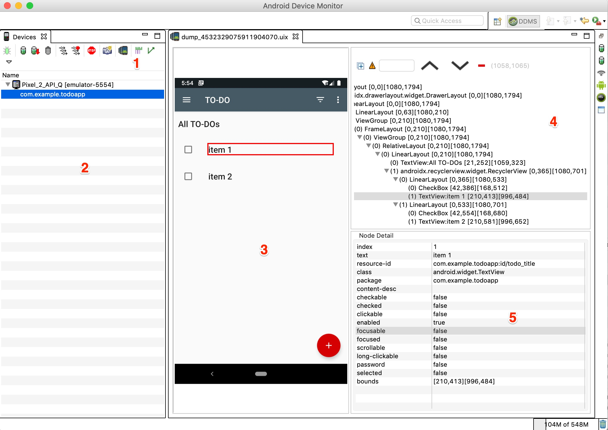

# ****Inspecting application UI with Android Device Monitor tool:****

Android Device Monitor was deprecated in Android Studio 3.1 and removed from Android Studio 3.2. But it still remains a powerful tool to inspect applications layout. The main advantage of Android Device Monitor compared to Layout Inspector is the possibility to inspect any application shown to the user at the given moment of time including system and 3rd party applications.

> ***Note:*** *there may be issues with running Android Device Monitor as it is deprecated. You may need to solve them on your own.*

Android Device Monitor is still the part of the Android SDK tools bundle and is located under the `.../Android/sdk/tools` directory. To open Android Device Monitor simply launch it from terminal or command line using `monitor` command.

As shown in figure 4, the Android Device Monitor contains multiple functional areas:
1. **Devices control panel:** with Screen capture and Dump view hierarchy buttons.
2. **Devices list:** list of devices and processes to inspect.
3. **View dumps:** view dump screenshots in `.uix` format.
4. **View hierarchy:** the hierarchy which allows you to highlight any view in view dump screenshot.
5. **Node Detail:** list of selected node properties.

**Figure 4.** Android Device Monitor tool

### Dump view hierarchy
To dump view hierarchy that is currently displayed on the mobile device simply select the device in **Devices list** and click on **Dump view hierarchy** button inside **Devices control panel** (figure 5). After that the `.uix` dump file will appear in **Visual view dumps representation** area.

**Figure 5.** Dump view hierarchy

### Inspect the view dump layout
To inspect view dump hover any element on the dump screenshot and click on it. The **View hierarchy** will highligt the selected view and its properties will be shown in **Node Detail** view.

In majority of cases the following node (i.e. view) properties are used to locate it inside the layout:
* ***index:*** the position of the node inside its parent.  
* ***text:*** the text of the node if applicable.
* ***resource-id:*** the id of the node represented in the following form `<application_package>:id/<node_id>`.
* ***package:*** application package.
* ***class:*** the class of the node element.
* ***content-desc:*** the content description of the element if applicable.
