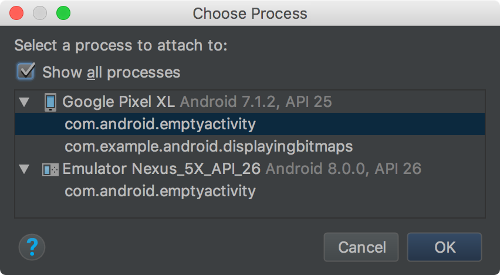
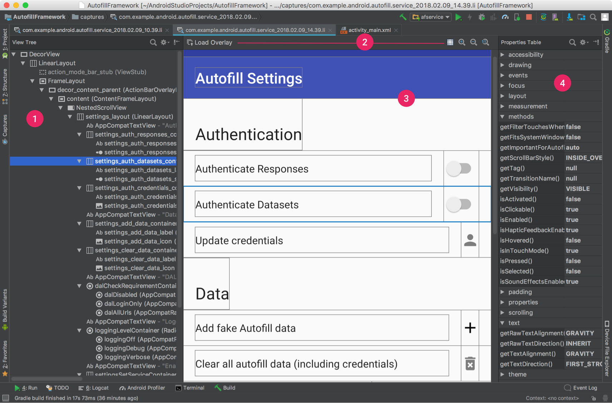
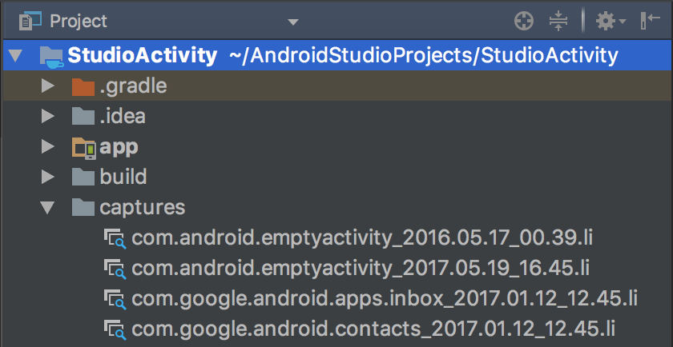

# **Inspecting application UI with Layout Inspector tool:**

To open the Layout Inspector, do the following:

* Run your app on a connected device or emulator.
* Click **Tools > Layout Inspector**.
* In the **Choose Process** dialog that appears, select the app process you want to inspect and click **OK**.

**Figure 1.** The Choose Process dialog

By default, the **Choose Process** dialog lists only the processes for the project currently open in Android Studio and running on the device or emulator. If you want to inspect a different app that's on the device, check **Show all processes**. If you're using a rooted device or an emulator without Google Play store, then you'll see all running apps. Otherwise, you'll see only running apps that are debuggable.

The Layout Inspector captures a snapshot, saves it as a `.li` file, and opens it.

As shown in figure 2, the Layout Inspector displays the following:
1. **View Tree:** The hierarchy of views in the layout.
2. **Layout Inspector toolbar:** Tools for the Layout Inspector.
3. **Screenshot:** Screenshot of app layout as it appears on your device, with layout bounds shown for each view.
4. **Properties Table:** The layout properties for the selected view.

**Figure 2.** The Layout Inspector

### Select a view
To select a view, click it in the **View Tree** or the screenshot. All of the layout attributes for the selected view appear in the **Properties Table**.
If your layout includes overlapping views, then only the view in front is clickable in the screenshot. To select a view that is not in front, click it in the **View Tree**.

### Isolate a view
To work with complex layouts, you can isolate individual views so that only a subset of the layout is shown in the **View Tree** and rendered in the screenshot.
You can isolate a view only when the device is still connected. Isolating a view requires the device to render the layout so that the Layout Inspector can take another screenshot.

To isolate a view, do one of the following:
* Double-click the view in the screenshot.
* Right-click the view in the **View Tree** and select **Render Subtree Preview**.
  
To return to the containing view, click the arrow in the top-left corner of the **Tree View**.

### Hide layout bounds
To hide the bounding box for a layout element, right-click the element in the **View Tree** and deselect **Show layout bounds**.
A layout element with **Show layout bounds** deselected can't be selected by clicking in the screenshot.

### Zoom in and use a reference grid to inspect layout details
You can control the grid overlay and zoom level of the screenshot using buttons in the Layout Editor toolbar:

* To zoom in on the screenshot, click **Zoom In** .
* To zoom out on the screenshot, click **Zoom Out** .
* To view the layout at a magnification at which one pixel in the screenshot corresponds to one pixel on the device, click **Actual Size** .
* To overlay a pixel grid, click **Grid** . The grid is available only at high zoom levels.

### Compare app layout to a reference image overlay
To compare your app layout with a reference image, such as a UI mockup, you can load a bitmap image overlay in the Layout Inspector.

* To load an overlay, click **Load Overlay**  at the top of the Layout Inspector. The overlay is scaled to fit the layout.
* To adjust the transparency of the overlay, use the **Alpha** slider.
* To remove the overlay, click **Clear Overlay** .
Take a new screenshot to capture layout changes
If the layout on the device changes, the **Layout Inspector** does not automatically update. To capture layout changes, create a new screenshot by again clicking **Tools > Layout Inspector**.

Each screenshot is saved in a separate `.li` file in `project-name/captures/` and opens in a new tab.

**Figure 3.** Layout Inspector screenshots (`.li` files) in the Project window

You can reload a previous screenshot by double-clicking the `.li` file in `project-name/captures/`.

*Portions of this page are reproduced from work created and shared by the Android Open Source Project and used according to terms described in the Creative Commons 2.5 Attribution License. (https://developer.android.com/studio/debug/layout-inspector)*
